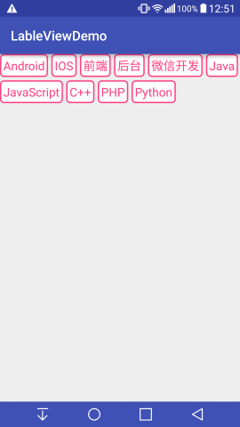

### LabelView

 

#### 使用

* xml中

```java

<tmnt.example.lableviewdemo.LabelView
    xmlns:android="http://schemas.android.com/apk/res/android"
    xmlns:app="http://schemas.android.com/apk/res-auto"
    android:id="@+id/label"
    android:layout_width="match_parent"
    android:layout_height="300dp"
    app:labelMargin="5dp"
    app:labelPadding="5dp"
    app:textColor="@color/colorAccent"
    app:textSize="6sp">
    </tmnt.example.lableviewdemo.LabelView>

```

app:labelMargin:labell间距
app:labelPadding:label内容距边框距离
app:textColor:文字颜色
app:textSize:文字大小

* activity中

```java
 mLabelView.setLabelBackgroundResource(res);//设置边框

List<String> list = new ArrayList<>();
list.add("Android");
list.add("IOS");
list.add("前端");
list.add("后台");
list.add("微信开发");
list.add("Java");
list.add("JavaScript");
list.add("C++");
list.add("PHP");
list.add("Python");

mLabelView.setLable(list);//设置标签

mLabelView.setOnLabelListener((v, position) ->
    Toast.makeText(MainActivity.this, "click:" + position
    , Toast.LENGTH_SHORT).show());//设置监听事件
```

#### 核心代码

* onMeasure()方法

    首先使用MeasureSpec计算设置不同模式(match_parent,wrap_content,real_value)下控件的width和height
```java

private int measureWidth(int measureSpec, int contentWidth) {
        int result = 0;
        int specMode = MeasureSpec.getMode(measureSpec);
        int specSize = MeasureSpec.getSize(measureSpec);

        if (specMode == MeasureSpec.EXACTLY) {
            result = specSize;
        } else {
            result = contentWidth + getPaddingLeft() + getPaddingRight();
            if (specMode == MeasureSpec.AT_MOST) {
                result = Math.min(result, specSize);
            }
        }
        result = Math.max(result, getSuggestedMinimumWidth());
        return result;
    }

```

    设置子元素的宽高
```java

 View view = getChildAt(i);
 measureChild(view, widthMeasureSpec, heightMeasureSpec);

```

    获取每个子元素的宽高,并将宽度累加，之后和labelView的总宽度比较。
    当累加和超过总宽度，进行换行，下一行高度为LableMargin+子元素height
    换行标志位设true。
```java
for (int i = 0; i < count; i++) {
    View view = getChildAt(i);
    measureChild(view, widthMeasureSpec, heightMeasureSpec);

    if (maxWidth < currWidth + view.getMeasuredWidth()) {
        maxItemHeight += mLableMargin;
        maxItemHeight += view.getMeasuredHeight();
        currWidth = 0;
        begin = true;
    }
    maxItemHeight = Math.max(maxItemHeight, view.getMeasuredHeight());
    if (!begin) {
        currWidth += mLableMargin;
    } else {
        begin = false;
    }
    currWidth += view.getMeasuredWidth();

    maxWidth = Math.max(maxWidth, currWidth);

    setMeasuredDimension(measureWidth(widthMeasureSpec, maxWidth)
        , measureHeight(heightMeasureSpec, maxItemHeight));

}
```

* onLayout方法

    和onMeasure方法同，x和子view的宽累加，超出总宽度，换行。
    y为LabelMargin和子view的和。

```java
for (int i = 0; i < count; i++) {
    View view = getChildAt(i);

    if (contentWidth < x + view.getMeasuredWidth()) {
        x = getPaddingLeft();
        y += mLableMargin;
        y += maxItemHeight;
        maxItemHeight = 0;
    }
    view.layout(x, y, x + view.getMeasuredWidth(), y + view.getMeasuredHeight());
    x += view.getMeasuredWidth();
    x += mLabelPadding;
    maxItemHeight = Math.max(maxItemHeight, view.getMeasuredHeight());
}
```

* addLabel

    根据setLabel传如的list创建TextView，并设置监听事件。

```java
TextView lable = new TextView(mContext);
lable.setPadding(mLabelPadding, mLabelPadding, mLabelPadding, mLabelPadding);
lable.setTextColor(mTextColor);
lable.setTextSize(mTextSize);
lable.setText(text);
if (mTextBackground != 0) {
    lable.setBackgroundResource(mTextBackground);
}
lable.setOnClickListener(new OnClickListener() {
    @Override
    public void onClick(View v) {
        if (mOnLabelListener != null) {
            mOnLabelListener.labelClick(v, position);
        }
    }
});
addView(lable);
```


    
